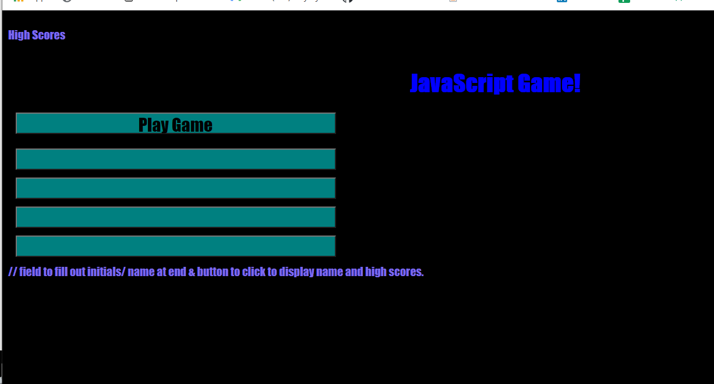

# Homework04
I made a play button which starts the timer (not working yet) and displays the first question and array of answers.
I made an array of questions with answers and the correct answer in js. 
I made if else statements to determine and alert the user if their answer is correct or wrong.
If answer is correct, "correct!" will display. If incorrect, "wrong!" will display and 5 seconds will be taken off timer. (not working yet)
At the end of the 5 questions, I made a button which the user can click and then enter their initials. (not working yet)
The user will then be directed to the high score list, where there is a button to take them back to the beginning of the game. (not working yet)
See 

